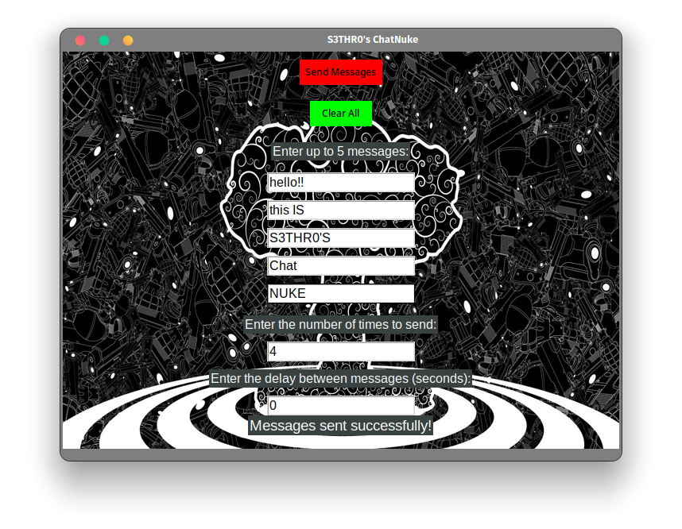

# ChatNuke

## Overview

ChatNuke is a Python application that leverages the 'pyautogui' library to send a specified message multiple times. It offers an interactive Graphical User Interface (GUI) through which users can enter the desired message and the number of repetitions.

## Installation

To get started with ChatNuke, follow these steps:

1. Clone this repository by running the following command in your terminal: `git clone https://github.com/S3THR0/Chat_Nuke.git`
2. Install the required packages by executing: `pip install -r requirements.txt`

## Usage

To use ChatNuke, perform the following actions:

1. Run the 'chatnuke.py' file using Python.
2. Within the application's GUI, enter the message you want to send and the desired number of repetitions.
3. Click the 'Send Messages' button to initiate the process.
4. Confirm the action when prompted by the application.
5. Once the process is complete, a message will be displayed to indicate the finishing of the operation.

Feel free to customize your messaging experience with ChatNuke and unleash the power of automated message sending!
